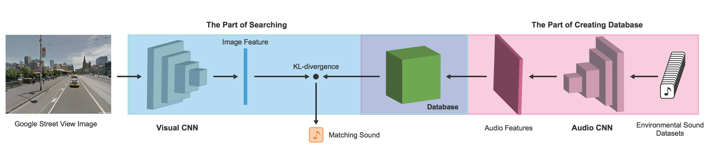

# Imaginary Soundscape Demo

## Overview
- This is a demo repository of "[Imaginary Soundscape](http://imaginarysoundscape2.qosmo.jp/)" project by [Qosmo, Inc.](http://qosmo.jp/).
- On [the project website](http://imaginarysoundscape2.qosmo.jp), you can add AI-generated soundscape to any images you upload or specify. You can try the same process with this repository.
- Our model is based on [SoundNet](http://soundnet.csail.mit.edu/), proposed in 2016.
- Our code is written in Python3 using keras and librosa.

## How to use
1. Please download [this zipped data file](https://github.com/Kajiyu/ImaginarySoundscapeDemo/releases/download/v1.0.0/data.zip) and unzip it into the same directory as `playground.ipynb`.
2. Open `playground.ipynb` with Jupyter notebook.

## References
- [Imaginary Soundscape website](http://imaginarysoundscape2.qosmo.jp/)
- [Original demo of Imaginary Soundscape](http://imaginarysoundscape.qosmo.jp/)
- [Short paper at NIPS2017 Workshop](https://nips2017creativity.github.io/doc/Imaginary_Soundscape.pdf)  
"Imaginary Soundscape: Cross-Modal Approach to Generate Pseudo Sound Environments"  
Yuma Kajihara, Shoya Dozono, Nao Tokui
- [Imaginary Soundscape — Take a walk in soundscapes “imagined” by AI](https://medium.com/@naotokui/imaginary-soundscape-take-a-walk-in-soundscapes-imagined-by-ai-f8b99f82eefb) - A post on medium.com

## Model

## Prerequisites
- Python 3 (>= 3.6)
- Jupyter Notebook
- keras (2.x)
- librosa
- scipy
- Linux or MacOSX

## Credits
- Concept/Machine Learning: Nao Tokui @naotokui
- Machine Learning: Yuma Kajihara @kajiyu
- UI Design/Programming: Shoya Dozono and Robin Jungers @robinjungers 
